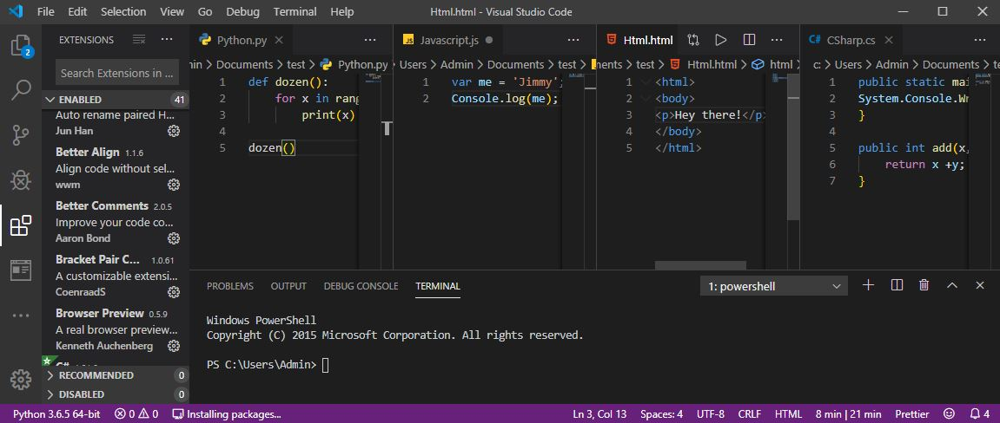

# Web Developer Extension Pack - For Python and Javascript Developer 
This extension pack includes some of the best vs-code extensions for django and Javascript developers.

The **WebDeveloperPack** includes: 

* [Bracket Pair Colorizer] (https://marketplace.visualstudio.com/items?itemName=coenraads.bracket-pair-colorizer)
* [30 Seconds of Code] (https://marketplace.visualstudio.com/items?itemName=30-seconds.30-seconds-of-code)
* [Auto Close Tag] (https://marketplace.visualstudio.com/items?itemName=formulahendry.auto-close-tag)
* [Auto Rename Tag] (https://marketplace.visualstudio.com/items?itemName=formulahendry.auto-rename-tag)
* [Better Align] (https://marketplace.visualstudio.com/items?itemName=wwm.better-align)
* [Better Comments] (https://marketplace.visualstudio.com/items?itemName=aaron-bond.better-comments)
* [Browser Preview] (https://marketplace.visualstudio.com/items?itemName=auchenberg.vscode-browser-preview)
* [Code Runner] (https://marketplace.visualstudio.com/items?itemName=formulahendry.code-runner)
* [Code Time] (https://marketplace.visualstudio.com/items?itemName=softwaredotcom.swdc-vscode)
* [CSS Peek] (https://marketplace.visualstudio.com/items?itemName=pranaygp.vscode-css-peek)
* [Chrome Debugger] (https://marketplace.visualstudio.com/items?itemName=msjsdiag.debugger-for-chrome)
* [Djaneiro] (https://marketplace.visualstudio.com/items?itemName=thebarkman.vscode-djaneiro)
* [Django Template] (https://marketplace.visualstudio.com/items?itemName=bibhasdn.django-html)
* [EditorConfig] (https://marketplace.visualstudio.com/items?itemName=editorconfig.editorconfig)
* [ESlint] (https://marketplace.visualstudio.com/items?itemName=dbaeumer.vscode-eslint)
* [GitLens] (https://marketplace.visualstudio.com/items?itemName=eamodio.gitlens)
* [GitLink] (https://marketplace.visualstudio.com/items?itemName=qezhu.gitlink)
* [Html Snippets] (https://marketplace.visualstudio.com/items?itemName=abusaidm.html-snippets)
* [IntelliSense for CSS class names in HTML] (https://marketplace.visualstudio.com/items?itemName=zignd.html-css-class-completion)
* [JavaScript Snippets] (https://marketplace.visualstudio.com/items?itemName=xabikos.javascriptsnippets)
* [Javascript Booster] (https://marketplace.visualstudio.com/items?itemName=sburg.vscode-javascript-booster)
* [LiveServer] (https://marketplace.visualstudio.com/items?itemName=ritwickdey.liveserver)
* [Material Icon] (https://marketplace.visualstudio.com/items?itemName=pkief.material-icon-theme)
* [MySql] (https://marketplace.visualstudio.com/items?itemName=formulahendry.vscode-mysql)
* [Exec-Node] (https://marketplace.visualstudio.com/items?itemName=miramac.vscode-exec-node)
* [NPM Intellisense] (https://marketplace.visualstudio.com/items?itemName=christian-kohler.npm-intellisense)
* [Path Intellisense] (https://marketplace.visualstudio.com/items?itemName=christian-kohler.path-intellisense)
* [Polacode] (https://marketplace.visualstudio.com/items?itemName=pnp.polacode)
* [Prettier] (https://marketplace.visualstudio.com/items?itemName=esbenp.prettier-vscode)
* [Project Manager] (https://marketplace.visualstudio.com/items?itemName=alefragnani.project-manager)
* [Python] (https://marketplace.visualstudio.com/items?itemName=ms-python.python)
* [Quokka] (https://marketplace.visualstudio.com/items?itemName=wallabyjs.quokka-vscode)
* [Rest Client] (https://marketplace.visualstudio.com/items?itemName=humao.rest-client)
* [Setting-Sync] (https://marketplace.visualstudio.com/items?itemName=shan.code-settings-sync)
* [Sql Beautify] (https://marketplace.visualstudio.com/items?itemName=sensourceinc.vscode-sql-beautify)
* [Vscode intellicode] (https://marketplace.visualstudio.com/items?itemName=visualstudioexptteam.vscodeintellicode)

## Extensions Information:

### Bracket Pair Colorizer
itemName=coenraads.bracket-pair-colorizer

 
 

This extension allows matching brackets to be identified with colours. The user can define which characters to match, and which colours to use. 

  

### 30 Seconds of Code

 
 

JavaScript snippets you can understand in 30 seconds or less.

  

### Auto Close Tag 
(https://marketplace.visualstudio.com/items?itemName=formulahendry.auto-close-tag)

 
 

Automatically add HTML/XML close tag, same as Visual Studio IDE or Sublime Text does.

  

### Auto Rename Tag 
(https://marketplace.visualstudio.com/items?itemName=formulahendry.auto-rename-tag)

 
 

Automatically rename paired HTML/XML tag, same as Visual Studio IDE does.

  

### Better Align 
(https://marketplace.visualstudio.com/items?itemName=wwm.better-align)

 
 

Align your code by colon(:), assignment(=,+=,-=,*=,/=) and arrow(=>). It has additional support for comma-first coding style and trailing comment.

And it doesn't require you to select what to be aligned, the extension will figure it out by itself.

  

  

### Better Comments 
(https://marketplace.visualstudio.com/items?itemName=aaron-bond.better-comments)

 
 

The Better Comments extension will help you create more human-friendly comments in your code.
With this extension, you will be able to categorise your annotations into:

    Alerts
    Queries
    TODOs
    Highlights
    Commented out code can also be styled to make it clear the code shouldn't be there
    Any other comment styles you'd like can be specified in the settings

  

### Browser Preview 
(https://marketplace.visualstudio.com/items?itemName=auchenberg.vscode-browser-preview)

 
 

A real browser preview inside your editor that you can debug.

  

### Code Runner 
(https://marketplace.visualstudio.com/items?itemName=formulahendry.code-runner)

 
 

Run code snippet or code file for multiple languages: C, C++, Java, JavaScript, PHP, Python, Perl, Perl 6, Ruby, Go, Lua, Groovy, PowerShell, BAT/CMD, BASH/SH, F# Script, F# (.NET Core), C# Script, C# (.NET Core), VBScript, TypeScript, CoffeeScript, Scala, Swift, Julia, Crystal, OCaml Script, R, AppleScript, Elixir, Visual Basic .NET, Clojure, Haxe, Objective-C, Rust, Racket, Scheme, AutoHotkey, AutoIt, Kotlin, Dart, Free Pascal, Haskell, Nim, D, Lisp, Kit, V, and custom command

  

### Code Time 
(https://marketplace.visualstudio.com/items?itemName=softwaredotcom.swdc-vscode)

 
 

Programming metrics right in VS Code.

  

### CSS Peek 
(https://marketplace.visualstudio.com/items?itemName=pranaygp.vscode-css-peek)

 
 

This extension extends HTML and ejs code editing with Go To Definition and Go To Symbol in Workspace support for css/scss/less (classes and IDs) found in strings within the source code.

This was heavily inspired by a similar feature in Brackets called CSS Inline Editors.

  

### Chrome Debugger 
(https://marketplace.visualstudio.com/items?itemName=msjsdiag.debugger-for-chrome)

 
 

Debug your JavaScript code running in Google Chrome from VS Code.

  

### Djaneiro 
(https://marketplace.visualstudio.com/items?itemName=thebarkman.vscode-djaneiro)

 
 

A collection of snippets for django templates, models, views, fields & forms.

  

### Django Template 
(https://marketplace.visualstudio.com/items?itemName=bibhasdn.django-html)

 
 

This extension adds language colorization support and user snippets for the Django template language to VS Code.

This is based on the Jinja extension by the awesome wholroyd.

  

### EditorConfig 
(https://marketplace.visualstudio.com/items?itemName=editorconfig.editorconfig)

 
 

This plugin attempts to override user/workspace settings with settings found in .editorconfig files. No additional or vscode-specific files are required. As with any EditorConfig plugin, if root=true is not specified, EditorConfig will continue to look for an .editorconfig file outside of the project.

  

### ESlint 
(https://marketplace.visualstudio.com/items?itemName=dbaeumer.vscode-eslint)

 
 

Integrates ESLint into VS Code. If you are new to ESLint check the documentation.

The extension uses the ESLint library installed in the opened workspace folder. If the folder doesn't provide one the extension looks for a global install version. If you haven't installed ESLint either locally or globally do so by running npm install eslint in the workspace folder for a local install or npm install -g eslint for a global install.

On new folders you might also need to create a .eslintrc configuration file. You can do this by either using the VS Code command Create ESLint configuration or by running the eslint command in a terminal. If you have installed ESLint globally (see above) then run eslint --init in a terminal. If you have installed ESLint locally then run .\node_modules\.bin\eslint --init under Windows and ./node_modules/.bin/eslint --init under Linux and Mac.

  

### GitLens 
(https://marketplace.visualstudio.com/items?itemName=eamodio.gitlens)

 
 

https://dbaeumer.gallerycdn.vsassets.io/extensions/dbaeumer/vscode-eslint/2.0.13/1578513483369/Microsoft.VisualStudio.Services.Icons.Default

  

### GitLink 
(https://marketplace.visualstudio.com/items?itemName=qezhu.gitlink)

 
 

Inspired by GitHub extension for Visual Studio, this extension provide the feature that Go To current file's online link in browser and Copy the link in clipboard.

  

### Html Snippets 
(https://marketplace.visualstudio.com/items?itemName=abusaidm.html-snippets)

 
 

This extension adds rich language support for the HTML Markup to VS Code, including:

    Full HTML5 Tags
    Colorization
    Snippets
    [partially implemented] Quick Info
    description mentions if tag deprecated

  

### IntelliSense for CSS class names in HTML 
(https://marketplace.visualstudio.com/items?itemName=zignd.html-css-class-completion)

 
 

A Visual Studio Code extension that provides CSS class name completion for the HTML class attribute based on the definitions found in your workspace or external files referenced through the link element.

  

### JavaScript Snippets 
(https://marketplace.visualstudio.com/items?itemName=xabikos.javascriptsnippets)

 
 

This extension contains code snippets for JavaScript in ES6 syntax for Vs Code editor (supports both JavaScript and TypeScript).

  

### Javascript Booster 
(https://marketplace.visualstudio.com/items?itemName=sburg.vscode-javascript-booster)

 
 

Make your life easier, use code actions to do repetitive tasks for you! They can help a lot, just follow the light bulb ??!

This VS Code extension provides various code actions (quick fixes) when editing code in JavaScript (or TypeScript/Flow). Just note the light bulb at the left and press it to learn how you can transform the code under the cursor.

You might want to reassign the default shortcut for the quick fix menu to Alt+Enter if you are moving from WebStorm. Search for editor.action.quickFix command.

  

### LiveServer 
(https://marketplace.visualstudio.com/items?itemName=ritwickdey.liveserver)

 
 

Launch a local development server with live reload feature for static & dynamic pages.

  

### Material Icon 
(https://marketplace.visualstudio.com/items?itemName=pkief.material-icon-theme)

 
 

The Material Icon Theme provides lots of icons based on Material Design for Visual Studio Code.

  

### MySql 
(https://marketplace.visualstudio.com/items?itemName=formulahendry.vscode-mysql)

 
 

MySQL management tool

Features:
    Manage MySQL Connections (support SSL connection)
    List MySQL Servers
    List MySQL Databases
    List MySQL Tables
    List MySQL Columns
    Run MySQL Query

  

### Exec-Node 
(https://marketplace.visualstudio.com/items?itemName=miramac.vscode-exec-node)

 
 

Execute the current file or your selected code with node.js.

  

### NPM Intellisense 
(https://marketplace.visualstudio.com/items?itemName=christian-kohler.npm-intellisense)

 
 

Visual Studio Code plugin that autocompletes npm modules in import statements.

  

### Path Intellisense 
(https://marketplace.visualstudio.com/items?itemName=christian-kohler.path-intellisense)

 
 

Visual Studio Code plugin that autocompletes filenames.

  

### Polacode 
(https://marketplace.visualstudio.com/items?itemName=pnp.polacode)

 
 

Polaroid for your code

  

### Prettier 
(https://marketplace.visualstudio.com/items?itemName=esbenp.prettier-vscode)

 
 

Prettier is an opinionated code formatter. It enforces a consistent style by parsing your code and re-printing it with its own rules that take the maximum line length into account, wrapping code when necessary.

  

### Project Manager 
(https://marketplace.visualstudio.com/items?itemName=alefragnani.project-manager)

 
 

It helps you to easily access your projects, no matter where they are located. Don't miss that important projects anymore. You can define your own Favorite projects, or choose for auto-detect VSCode projects, Git, Mercurial and SVN repositories or any folder.

  

### Python 
(https://marketplace.visualstudio.com/items?itemName=ms-python.python)

 
 

A Visual Studio Code extension with rich support for the Python language (for all actively supported versions of the language: 2.7, >=3.5), including features such as IntelliSense, linting, debugging, code navigation, code formatting, Jupyter notebook support, refactoring, variable explorer, test explorer, snippets, and more!

  

### Quokka
(https://marketplace.visualstudio.com/items?itemName=wallabyjs.quokka-vscode)

 
 

Live Scratchpad for JavaScript.

  

### Rest Client 
(https://marketplace.visualstudio.com/items?itemName=humao.rest-client)

 
 

REST Client allows you to send HTTP request and view the response in Visual Studio Code directly.

  

### Setting-Sync 
(https://marketplace.visualstudio.com/items?itemName=shan.code-settings-sync)

 
 

Synchronize Settings, Snippets, Themes, File Icons, Launch, Keybindings, Workspaces and Extensions Across Multiple Machines Using GitHub Gist.

  

### Sql Beautify 
(https://marketplace.visualstudio.com/items?itemName=sensourceinc.vscode-sql-beautify)

 
 

VS Code extension that beautifies SQL using the vkbeautify module.

  

### Vscode intellicode 
(https://marketplace.visualstudio.com/items?itemName=visualstudioexptteam.vscodeintellicode)

 
 

The Visual Studio IntelliCode extension provides AI-assisted development features for Python, TypeScript/JavaScript and Java developers in Visual Studio Code, with insights based on understanding your code context combined with machine learning.

  

## Have a suggestion? 

Submit a PR to the [GitHub repo](https://github.com/jimongit/webdeveloperpack). 
And also check this beautiful theme pack (https://github.com/geoffstevens8/best-dark-themes-pack)
Markdown theme by (https://github.com/geoffstevens8/)
